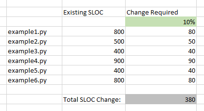
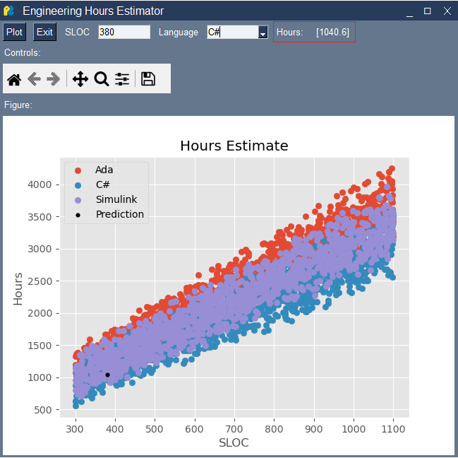

# Engineering Hours Estimator


<!-- TABLE OF CONTENTS -->
<details>
  <summary>Table of Contents</summary>
  <ol>
    <li>
      <a href="#about-the-project">About The Project</a>
      <ul>
        <li><a href="#built-with">Built With</a></li>
      </ul>
    </li>
    <li>
      <a href="#getting-started">Getting Started</a>
      <ul>
        <li><a href="#prerequisites">Prerequisites</a></li>
        <li><a href="#installation">Installation</a></li>
      </ul>
    </li>
    <li><a href="#usage">Usage</a></li>
  </ol>
</details>


<!-- ABOUT THE PROJECT -->
## About The Project

This model is intended to be used to more accurately estimate the effort required to complete model based development (MBD) activities. Most commercial bidding and estimating tools do not differentiate between programming languages, and they definitely do not account for the differences between hand coding and MBD. This can lead to large discrepancies in between the hours bid and the hours required to actually complete the activity.  We are focusing on MATLAB/Simulink in this model; however, it could be expanded to include other MBD tools. 

#### Model Based Development

MBD is a method of software development that is used the aerospace, automotive, and industrial equipment industries in applications with complex controls and signal processing. MBD offers some advantages in prototyping and testing over more traditional hand coding in these applications. An example application of MBD using Simulink, an anti-lock braking system, can be found on [Mathworks](https://www.mathworks.com/help/simulink/slref/modeling-an-anti-lock-braking-system.html). C/C++ code is generated from the model and then compiled for use in the final application.

## Estimation

Engineering bidding tools generally use Source Lines of Code (SLOC) counts as the primary variable when determining the hours required to complete a software task. However, SLOC counts from generated code do not line up 1:1 with hand coded SLOC counts for similar features. A more accurate approach would be to base the estimate on existing activities that used the same programming language.

## Model Development

This model was developed to estimate bid hours for three programming languages that are common in the aerospace, automotive, and industrial equipment industries; Ada, C#, and Simulink. Since actual charge activities and SLOC counts are not publicly available the model was trained and tested using generated activities. The sloc_hours.py file in this repo was used to generate the data set. 

#### Assumptions and Limitations

This is a simplified model that does not take into account any other variables that may be found in commercial bidding tools. Examples of these variables are: certification level, stability of the code base, and development methodology. These variables were omitted due to the lack of publicly available data. The generated data would either over or under weight the other variables and the resulting model would not provide any insight into the impact of those variables on a real activity. 

In order to use this model with real world data, additional analysis and model tuning would need to be done in order to get the best model fit.

<p align="right">(<a href="#readme-top">back to top</a>)</p>


### Built With

* Jupyter Notebook
* Python
    * Matplotlib
    * NumPy
    * pandas
    * pickle
    * PySimpleGUI
    * random
    * scikit-learn
    * Seaborn

<p align="right">(<a href="#readme-top">back to top</a>)</p>


<!-- GETTING STARTED -->
## Getting Started

The estimator requires the user to know the SLOC count for the change they are going to implement. This is usually obtained by estimating the scale of the change for each file or package. In the example shown below, 380 is the number that would be used in the estimator tool.



### Installation

1. Jupyter Notebook and all of the following python packages need to be installed prior to running the estimator:
    * Matplotlib
    * NumPy
    * pandas
    * PySimpleGUI
    * scikit-learn
    * Seaborn

   Note: pickle and random are in the Python standard library and do not need to be installed separately. 

2. Upload all files from this repo into Jupyter Notebook

<p align="right">(<a href="#readme-top">back to top</a>)</p>

<!-- USAGE EXAMPLES -->
## Usage

There are several ways to use this estimator:
1. Run the GUI eng_hours_est.py with the included dataset and model
   * In the Jupyter Lab terminal type:
   ```sh
   py eng_hours_est.py
   ```
   * In the GUI enter a number for SLOC, select a programming language, and then click Plot

   * The hours estimate will be shown in the upper right corner as well as on the scatter plot. The scatter plot also shows the data used to train the model for reference 
   
2. Create a new random dataset with sloc_hours.py and retrain the model Estimator.ipynb
   * Open sloc_hours.py in Jupyter Lab
   * Make any desired changes to the dataset parameters
       * Note: Changing the programming languages in the dataset will require additional changes in Estimator.ipynb and eng_hours_est.py
   * Run sloc_hours.py in the Jupyter terminal to create a new activities.csv file:
   ```sh
   py sloc_hours.py
   ```
   * Open and run the Notebook Estimator.ipynb to retrain the model and create overall_model.sav
   * Follow the steps in option 1 to use the GUI and estimate and activity
   
3. Use real data to retrain the model Estimator.py
   * Using activities.csv in this repo as an example, populate a dataset with real SLOC and hours
   * Open and run the Notebook Estimator.ipynb to retrain the model and create overall_model.sav
   * Follow the steps in option 1 to use the GUI and estimate and activity


<p align="right">(<a href="#readme-top">back to top</a>)</p>


